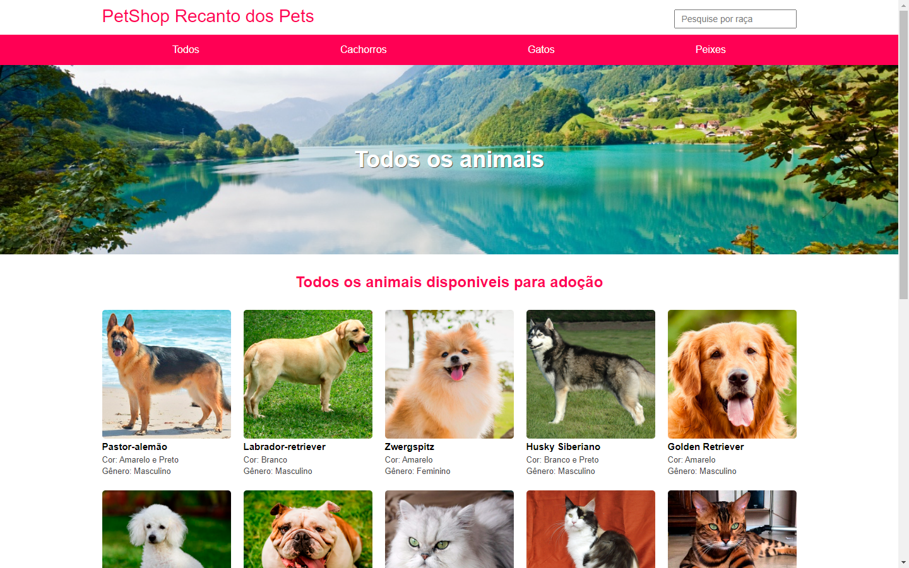

## PetShop-Nodets
Projeto feito em nodejs na aula de Desenvolvimento de Sistemas

## Pré-requisitos globais:
`npm i -g nodemon typescript ts-node`

## Instalação
`npm install`

## Para rodar o projeto
`npm run start-dev`

## Site PetShop

